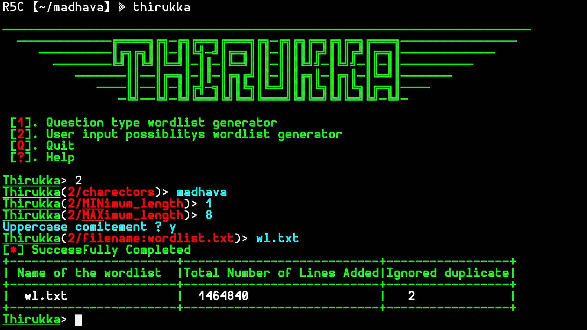

***
## _Thirukka_

### _WORD-LIST-GENARATOR_

Written in python3 script. It generates wordlist for password attacks, url broutforcing, hashcracking, domain discover, ...
***
### _REQUIRED:_
* PYTHON3

### _INSTLATION_
***
> _```git clone https://github.com/RED-5-CRACKERS/Thirukka.git && cd Thirukka && chmod +x setup && ./setup && pwd && echo && ls ```_
###  (COPY AND PAST) ☝️😁

or
##
> _```user@localhost:~$ git clone https://github.com/RED-5-CRACKERS/Thirukka.git```_
##
> _```user@localhost:~$ cd Thirukka```_
##
> _```user@localhost:~/Thirukka$ chmod +x setup```_
##
> _```user@localhost:~/Thirukka$ ./setup```_
##

### _RUN:_
***
> _```user@localhost:~$ thirukka ```_

or
##
> _```user@localhost:~/Thirukka$ ./thirukka ```_
***




